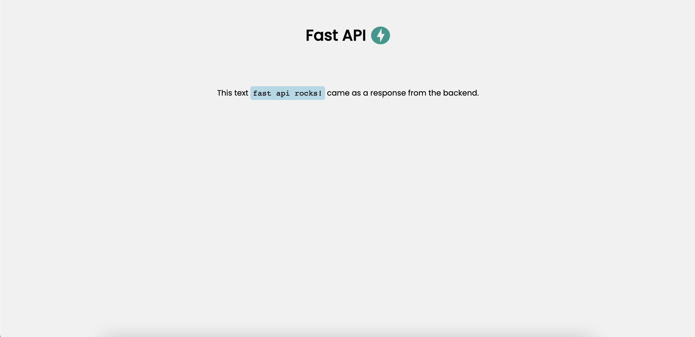

# Fast API Starter Kit
This repository is a starter kit for building a Fast API application. It includes a basic structure for a Fast API application with jinja templates and a static folder for css and js files.

## Installation
1. Clone the repository
```bash
git clone
```
2. Create a new conda environment
```bash
conda create -n fastapi python=3.11
```

3. Activate the conda environment
```bash
conda activate fastapi
```

4. Install the requirements
```bash
pip install -r requirements.txt
```

5. Run the application
```bash
uvicorn main:app --reload
```

Navigate to http://localhost:8000 to view the application.




### Congratulations! You have successfully run the application. 🎉🎉🎉
